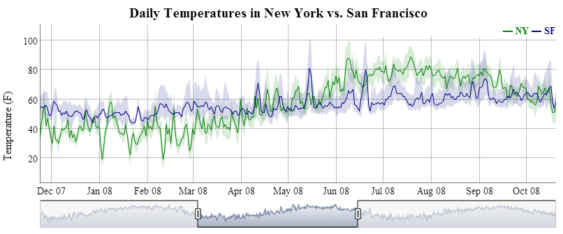
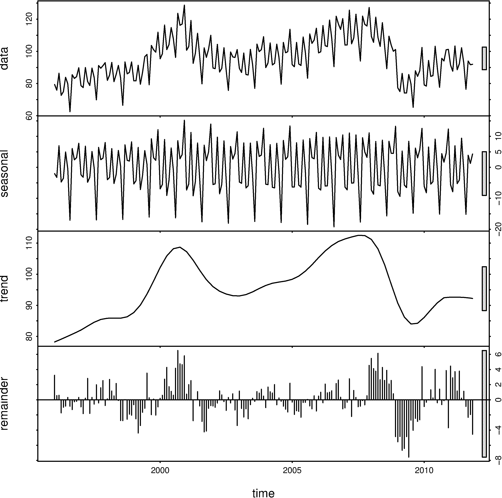
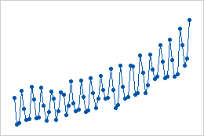
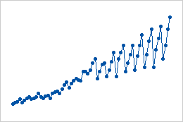
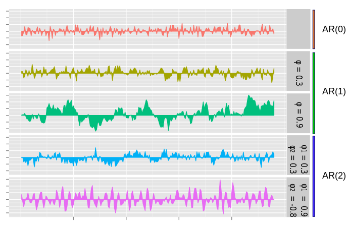
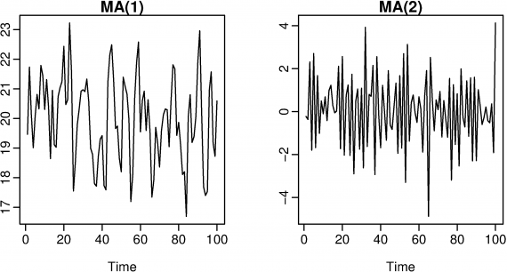
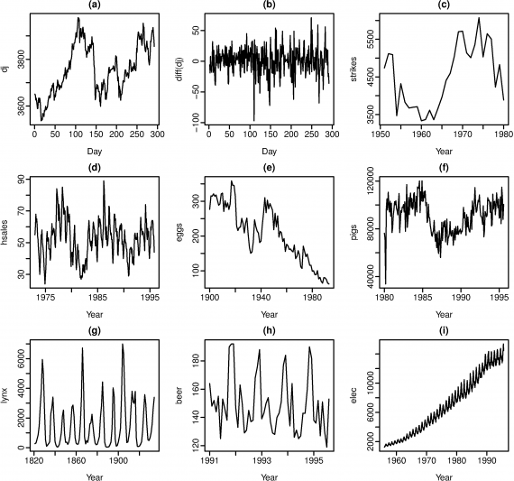

### What's a time series

A set of observations at regular time intervals

--

### Univariate time series
Forecast a single value

> What's the price of AAPL next Friday?

--

### Multivariate time series
Model interactions between multiple variables

> What's the pollution level tomorrow,
> given today's temperature, humidity, and UV?

---

### Time series components

Decomposition: splits a time series into components

--

### Components
| Component | Description |
|--|--|
| Trend | the long-term progression |
| Cyclical | long-term, repeated, non-periodic fluctuations |
| Seasonal | fixed (short or long) term, periodic fluctuations |
| Noise | random, residual, remainder |

--

### Cyclical

--

### Components

* Not every components is present
* Time series with only noise: can't be forecasted => guess using average
  * White noise: zero mean, constant std deviation
* Long term is typically > 1 year (depending ...)

--

### Additive model
<pre><code class="nohighlight">y(t) = Trend + Cyclical + Seasonal + Noise</code></pre>

Linear, consistent changes by the same amount

--

### Multiplicative model
<pre><code class="nohighlight">y(t) = Trend * Cyclical * Seasonal * Noise</code></pre>

Non-linear changes in frequency and magnitude (e.g. quadratic, exponential) 

---

### Forcasting models

* Statistical methods: AR, MA, ARMA, ARIMA, VAR
* Deep learning: LSTM

---

### Autoregressive model

$AR\(p\): X\_t=c + \sum\_{i=1}^p \varphi\_iX\_{t-i} + \varepsilon\_t$

Output depends on past values + white noise

--

$AR\(p\): X\_t=c + \sum\_{i=1}^p \varphi\_iX\_{t-i} + \varepsilon\_t$

* $X\_t$ = current value
* $X\_{t-i}$ = past values
* $p$ = order (time lag)
* $c$ = constant
* $\varepsilon\_t$ = white noise
* $\varphi\_1,...\varphi\_p$ = parameters

--

* $AR\(0\): X\_t=c + \varepsilon\_t$
* $AR\(1\): X\_t=c + \varphi\_1X\_{t-1} + \varepsilon\_t$
* ...

--

### Moving-average model

$MA\(p\): X\_t=\mu + \varepsilon\_t + \sum\_{i=1}^p\theta\_i\varepsilon\_{t-i}$

Output depends on past + current white noise

--

$MA\(p\): X\_t=\mu + \varepsilon\_t + \sum\_{i=1}^p\theta\_i\varepsilon\_{t-i}$

* $X\_t$ = current value
* $p$ = order (time lag)
* $\mu$ = mean of $X\_t$
* $\varepsilon\_1,...\varepsilon\_{t-p}$ = white noise
* $\theta\_1,...\theta\_p$ = parameters

--

* $MA\(0\): X\_t=\mu + \varepsilon\_t$
* $MA\(1\): X\_t=\mu + \varepsilon\_t + \theta\_1\varepsilon\_{t-1}$
* $MA\(2\): X\_t=\mu + \varepsilon\_t + \theta\_1\varepsilon\_{t-1} + \theta\_2\varepsilon\_{t-2}$
* ...

--

#### Autoregressive-moving-average model

$ARMA\(p, q\): AR\(p\) + MA\(q\)$

$X\_t=c + \varepsilon\_t + \sum\_{i=1}^p \varphi\_i X\_{t-i} + \sum\_{i=1}^q\theta\_i\varepsilon\_{t-i}$

--

##### Autoregressive-integrated-moving-average

$ARIMA\(p, d, q\):$

$\biggl(1-\sum\_{i=1}^p\varphi\_iB\_i\biggr)(1 - B)^dX\_t = c + \biggl(1 + \sum\_{i=1}^q\theta\_iB^i\biggr)\varepsilon\_t$

* $p$ = order of $AR$ part
* $d$ = degree of differentiation
* $q$ = order of $MA$ part
* $B$ = lag operator (shifts $X\_t$ back in time)
* ... rest same as $MA$, $AR$

--

$$X'\_t = c + \varepsilon\_t + \sum\_{i=1}^p \varphi\_i X'\_{t-i} + \sum\_{i=1}^q\theta\_i\varepsilon\_{t-i}$$

* $X'\_t$ = time series $X\_t$, differentiated $d$ times
* Why differentiated?

--

### Stationarity

* Statistical techniques (AR, MA, ...) may expect a stationary time series
* Stationary time series: mean, variance, covariance don't depend on time
* Solution: differentiation
  * Transforms a non-stationary series to stationary 

--

Spot the stationary series...

[answer](https://www.otexts.org/fpp/8/1)

--

* Differentiation degree $d$ in $ARIMA\(p,q,d\)$
* Generalized form of other time series models

| Series | Model |
|--|--|
| White noise | $ARIMA\(0,0,0\)$ |
| Random walk | $ARIMA\(0,1,0\), c = 0$ |
| Random walk + drift | $ARIMA\(0,1,0\), c \neq 0$ |
| $AR\(p\)$ | $ARIMA\(p,0,0\)$ |
| $MA\(q\)$ | $ARIMA\(0,0,q\)$ |

--

### ARIMA variants

* Seasonal ARIMA: $SARIMA\(p, d, q\)\(P, D, Q\)\_m$
  * $m$ = number of periods per season (e.g. weekly = 52)
  * $ARIMA\(p, d, q\)$ multiplied by $ARIMA\(P, D, Q\)\_m$

* ARIMAX: ARIMA + eXplanatory variable $X\beta$

--

### Vector Autoregression

$AR\(p\): X\_t=c + \sum\_{i=1}^p \varphi\_iX\_{t-i} + \varepsilon\_t$

$VAR\(p\): Y\_t=c + \sum\_{i=1}^p \Pi\_iY\_{t-i} + \epsilon\_t$

Basically $AR\(p\)$ for multivariate time series (vector $Y\_t$)

--

### Python

* Transformation: [pandas.series](https://pandas.pydata.org/pandas-docs/stable/generated/pandas.Series.html)

* Statistical Analysis: [statsmodels.tsa](https://www.statsmodels.org/stable/tsa.html)

* Decomposition: statsmodels.tsa.seasonal_decompose

* Plots: [statsmodels.graphics.tsaplots](http://www.statsmodels.org/dev/graphics.html#module-statsmodels.graphics)

--

### Plots

* Residual plot
* Autocorrelation
* Partial Autocorrelation

https://machinelearningmastery.com/gentle-introduction-autocorrelation-partial-autocorrelation/

---

### LSTM

---

### Comparison

---

### Challenges

A paragraph with some text and a [link](http://hakim.se).

---

### Workshop

Some text here
