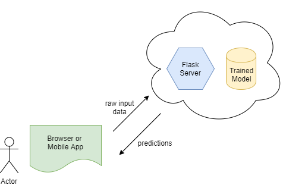
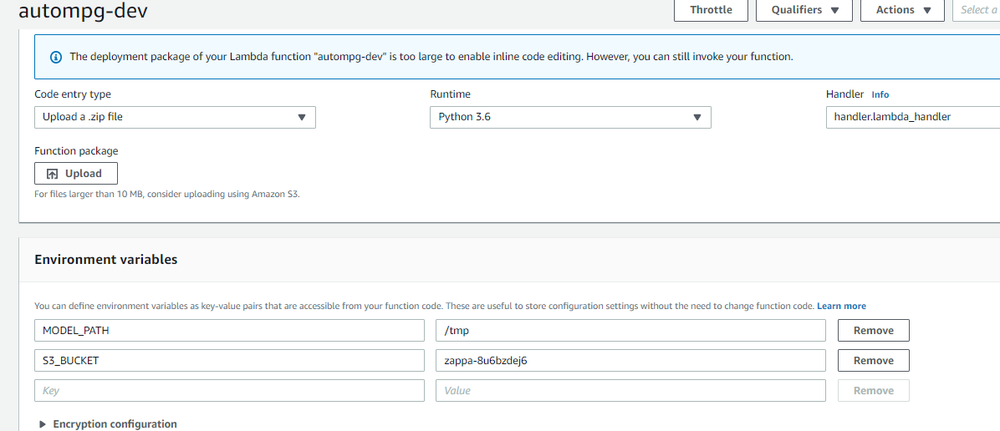

## Web Deployment of Machine Learning Model

Here is a simple example illustrating how a trained Machine Learning model can be deployed in the backend of a web server.



Using the browser or a mobile app, a user sends raw input data to the web application (running on a Flask server, for example). The web application queries the trained model, gets predictions, and returns the results back to the user.

## Setup
```
conda create -n zappa python=3.6
conda activate zappa
pip install Flask zappa
conda install scikit-learn pandas
```

## Run locally
```
python myapp.py
```

Go to http://127.0.0.1:5000 from your browser.

## Deploy to AWS

1. To keep the deployment size small, it is a good practice to create another conda environment (or virtual environment) that only contains the python packages that are used in the Flask app. You can refer to requirements.txt to see the required packages.
2. Update `zappa_settings.json` to:
  - Your AWS credentials (stored in %UserProfile%\.aws or ~/.aws), see https://docs.aws.amazon.com/cli/latest/userguide/cli-configure-files.html for how to use the aws-cli
  - Your S3 bucket name
3. Ensure that the following environments are setup for the Lambda in AWS console:
  - MODEL_PATH to `/tmp`
  - S3_BUCKET to the S3 bucket set in `zappa_settings.json`

  For example:
  

4. Deploy the app
```
set VIRTUAL_ENV=/path/to/virtual/env
zappa deploy dev
```

Once deployed once, you need to use `update` to update the app
```
set VIRTUAL_ENV=/path/to/virtual/env
zappa update dev
```

5. From AWS console, upload the pickle files to your S3 bucket that is created in step 4. Once the files are uploaded to S3, you can also test the model locally to verify that it can access S3:

```
set MODEL_PATH=tmp
set S3_BUCKET=zappa-8u6bzdej6
python myapp.py
```


To view deployment errors:
```
zappa tail
```

One common error is Flask not found. This can appear if `slim_handler` is set to true, due to a bug / limitation in Zappa (see: https://github.com/Miserlou/Zappa/issues/1491, for example).


## Code Layout:
* myapp.py: a simple Flask application. This supports a POST and GET request to a form that receives user input. Note that this form is just an example of one way to receive input. A more automated way is to define a REST API that receives the input in JSON format. 
* models.py: a python class that loads a pre-trained model (trained using sklearn_example.train.py in the parent folder), and uses the model to perform predictions.

## References
- http://flask.pocoo.org/docs/1.0/quickstart/
- https://scotch.io/bar-talk/processing-incoming-request-data-in-flask
- http://jinja.pocoo.org/
- https://hackernoon.com/deploy-a-serverless-flask-application-on-aws-lambda-d8ca58af42a4
